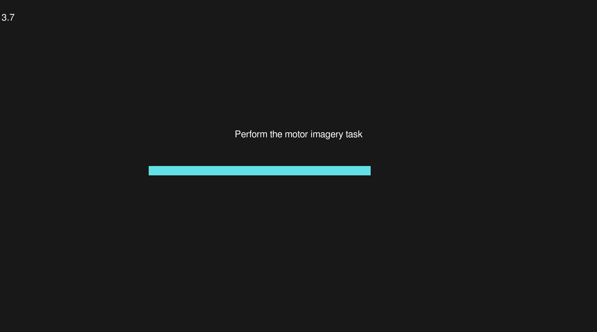

# Brain-Computer Interface calibration

An EMG-controlled interface for BCI calibration with a gamification mode powered via [Brainflow](https://brainflow.org/).

> [!WARNING]  
> This repository is a work in progress and is not ready for use.

This interface has two modes:
* An instruction-only interface with no feedback

* A gamified interface with EMG feedback **(work in progress)**

The goal of this project is to provide an interface for subjects performing motor imagery tasks. The gamification mode is intended to provide a more engaging experience for subjects.

## Installation

* Clone the repository
* Install the dependencies with `pip install -r requirements.txt`

## Usage
Run the interface with `python main.py`. There are three scenes available:
  * `--mode setup` (default) will allow you to find the correct EMG threshold for the subject
  * `--mode instructions` will display the scene with bare motor imagery instructions
  * `--mode game` will display the scene with the gamified interface

You can ingest data from a file using `--playback` option, which will read from `emg-example.txt` (see the file for the format).

Alternatively, you can ingest data from OpenBCI (if `--playback` is not provided). This assumes the OpenBCI GUI is running and streaming data to `225.1.1.1:6677`. At this time the program only reads the data from the channel 1.

There are a couple of other options available, consult `python main.py --help` for more information

# Licensing

The code is licensed under the GPLv3 license. See the LICENSE file for more information.

The graphical assets are created by [Kenney](https://kenney.nl) and are CC0 licensed (public domain). See the ASSETS-LICENSE file for more information.
