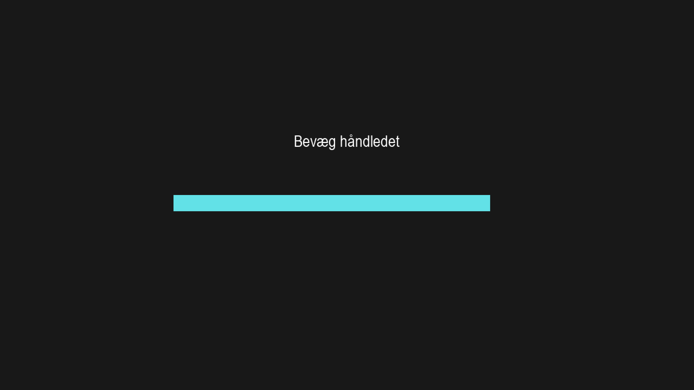
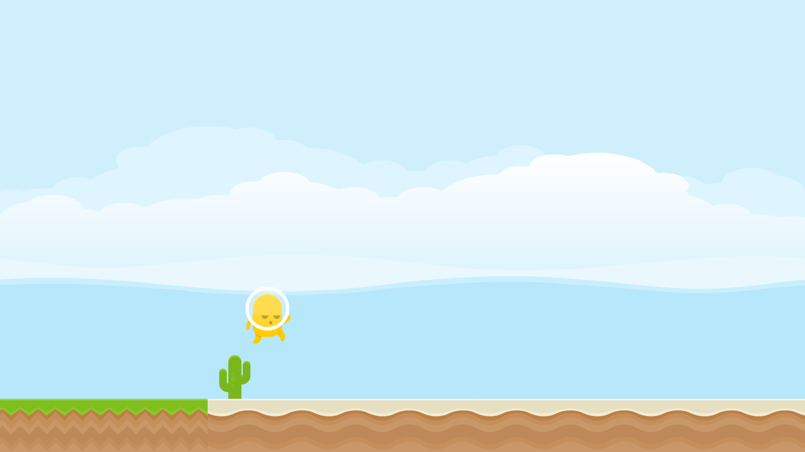

# Brain-Computer Interface calibration

An EMG-controlled interface for BCI calibration with a gamification mode powered via [Brainflow](https://brainflow.org/).

This interface has two modes:
* An instruction-only interface with no feedback

* A gamified interface with EMG feedback

The goal of this project is to provide an interface for subjects performing motor tasks. The gamification mode is intended to provide a more engaging experience for subjects.

## Installation

* Clone the repository
* Install the dependencies with `pip install -r requirements.txt`

## Usage
Run the interface with `python main.py`.

### Scene selection
There are two scenes available:
  * `--mode instructions` (default) will display the scene with bare motor task instructions
  * `--mode game` will display the scene with the gamified interface

### Data source
There are three ways to ingest data:
  * `--input cyton` (default) will ingest data directly from OpenBCI Cyton board
  * `--input playback` will ingest data from a file recorded with Brainflow. 
    * By default, the data is streamed from `examples/example_1.csv`. Use `--file <FILENAME>` to specify a different file.
  * `--input openbci` will ingest data from OpenBCI GUI on `225.1.1.1:6677`. The assumption is that the streamed data come from a Cyton board.

### Additional options
* `--fullscreen` will display the interface in fullscreen mode. If not provided, the interface will be displayed in a small 800x600 window.
* `--channel <CHANNEL_NUMBER>` will select the channel to use for the EMG feedback. By default, channel 1 is used.

# Licensing

The code is licensed under the GPLv3 license. See the LICENSE file for more information.

The graphical assets are created by [Kenney](https://kenney.nl) and are CC0 licensed (public domain). See the ASSETS-LICENSE file for more information.
